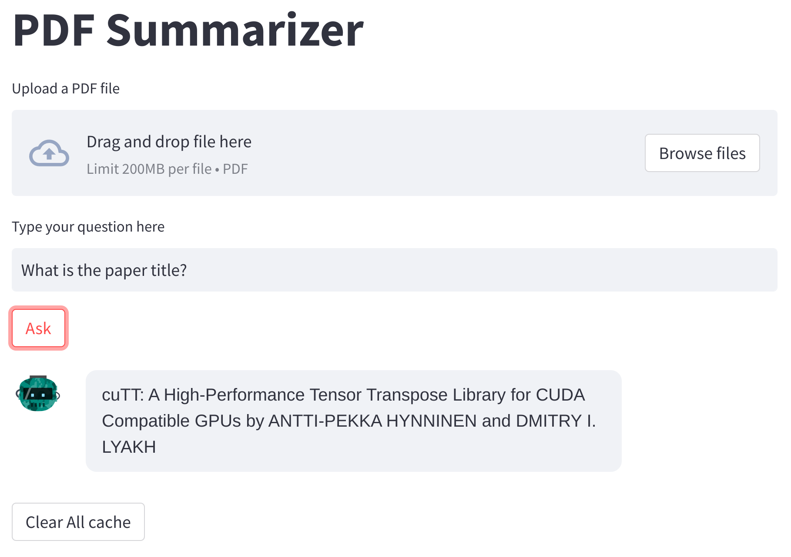

# PDF Summarizer with GPT and Streamlit

This project is a PDF summarizer that leverages GPT AI to generate summaries from uploaded PDF files. The application uses FastAPI for the backend and Streamlit for the frontend. The project was created with the assistance of AI language models. Please find more details in the [Blog post](https://zenn.dev/zerebom/articles/1ffd51da420c9e) and [Slides](https://speakerdeck.com/zerebom/chatgpttonohui-hua-nodetafen-xi-kai-fa-dui-hua-wozui-shi-hua-surutamenozhi-zhen-tote-xing).



## Building

```
git clone https://github.com/zerebom/gpt-pdf-summarizer.git
cd gpt-pdf-summarizer
docker build -t gpt-pdf-summarizer .
```

## Deployment

Add an `.env` file with your OpenAI API key:

```
OPENAI_API_KEY=sk-...
```

Start the Docker container:

```
docker-compose up -d
```

Access FastAPI and Streamlit applications:

- **FastAPI**: Open your browser and navigate to http://localhost:8001. You will see the FastAPI documentation (Swagger UI).
- **Streamlit**: Open your browser and navigate to http://localhost:8501. You will see the Streamlit user interface where you can upload PDF files and get summaries.

## Usage

1. In the Streamlit app, upload a PDF file using the file uploader.

2. Once the file is uploaded, the application will extract the text from the PDF and send it to the GPT API for summarization.

3. The summarized text will be displayed on the Streamlit app. You can also interact with the GPT AI to ask questions about the summarized content.

## License

This project is licensed under the MIT License - see the `LICENSE` file for details.

